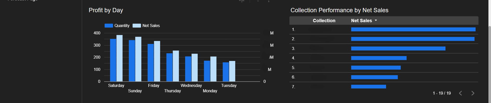
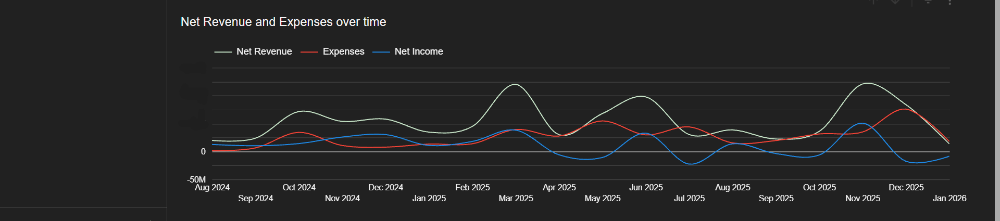
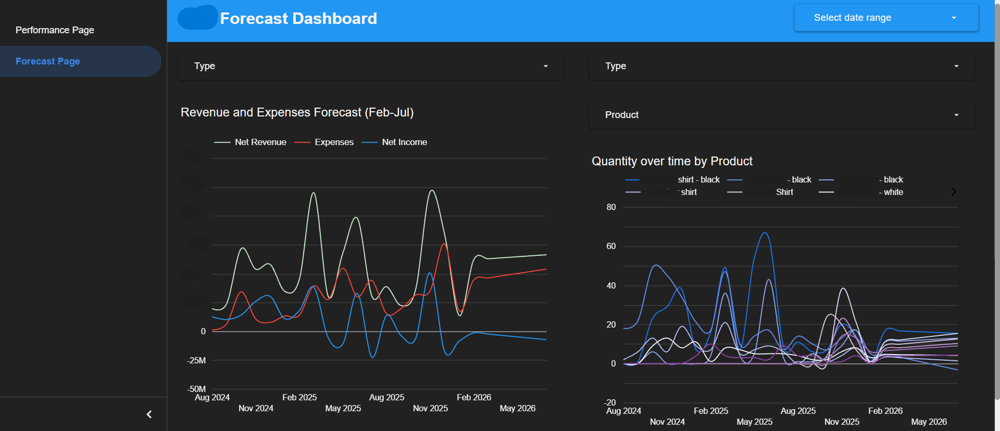

# FashionBrand-visual-dashboard
> A project i undertook to breakdown, visualize and interpret a fashion brand's data to provide insights and ease business health assessments.
> A business performance dashboard built in Looker Studio for a fashion retail brand, 
> tracking product sales, expense breakdown, and daily profitability.

## Overview
This dashboard provides the brand with real-time visibility into:
### Performance Page:
- **Product Performance** — which SKUs drive the most revenue.
- **Expense Breakdown** — spend across Salaries, Marketing, R&D, Admin, and Shipping.
- **Daily Profit Trends** — quantity sold vs. net sales over time to determine which days are most optimal for sales.
- **Collection Rankings** — net sales by collection.
- **Lifetime P&L Chart** - Derived from lifetime data to produce a chart including lifetime revenues, expenses and profit. Equipped with a date controller for a more focused examination on specific date ranges.
### Forecast Page:
- **Profit & Expense Forecast** - Linear Forecasting utilizing lifetime data, equipped with actual and forecast data filter alongside date controller for data drill downs.
- **Product Performance** - Brokedown each product's lifetime performance and conducted linear forecasting. Equipped with product filter alongside a date controller allowing for in-depth drill downs on product performance.

## Tools Used
- **Looker Studio** — dashboard design and visualization
- **Google Sheets & Excel** — data source and transformation

## Screenshots
### Performance Page

### Forecast Page

## Data
- Source: Internal sales and expense records
- Period: Aug 2024 - Feb 2026

## Key Insights
- Identified a significant revenue dip in Aug 2025 which coincided with a significant price hike
- Proposed a mitigation plan and further product strategic development plan to mitigate and circumvent further revenue dip 
- Identified Top Performing Collections
- Identified several top performing products
- Brokedown days by profitability in a revenue vs sales context
- Salaries represent the largest expense category, with Marketing as second

## Author
Rama — https://www.linkedin.com/in/ramadhan-pw/ | https://www.upwork.com/freelancers/~01c13c30f2f1bf2f45
